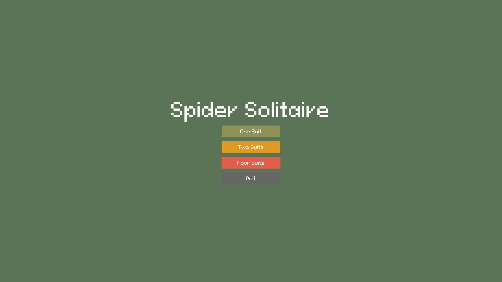
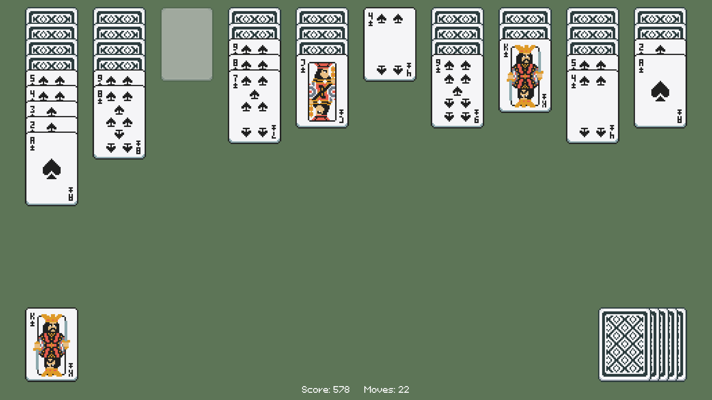

# Pixel Spider Solitaire (Rust + Bevy)

A classic Spider Solitaire game implementation built from scratch using **Rust** and the **Bevy** game engine.




## How to Play

### Objective
Arrange all cards in the tableau into descending sequences from **King to Ace** of the **same suit**.
* Once a full sequence (K, Q, J, 10... 2, A) is assembled, it flies to the foundation.
* Assemble 8 full sequences to win the game.

### Rules
1.  **Moving Cards**: You can drag a card onto another if the target card is exactly **one rank higher** (e.g., placing a 9 on a 10).
2.  **Moving Groups**: You can drag a stack of cards only if they are sorted and share the **same suit**.
3.  **Empty Columns**: Any card or valid group of cards can be moved to an empty column.
4.  **The Stock**: Click the deck in the bottom-right corner to deal a new row of cards.

### Controls

| Action | Input |
| :--- | :--- |
| **Select / Drag** | Left Mouse Button (Hold & Move) |
| **Deal Cards** | Click the Deck (Bottom Right) |
| **Undo** | `Z` Key |
| **Return to Menu** | `Esc` Key |
| **Quit Game** | Click "Quit" in Menu |

## Getting Started

### Prerequisites
You need to have the **Rust** toolchain installed. If you haven't, install it via [rustup.rs](https://rustup.rs/).

### Installation

1.  **Clone the repository**
    ```bash
    git clone https://github.com/zhangchicheng/spider-solitaire.git
    cd spider-solitaire
    ```

2.  **Run the game**
    ```bash
    # Run in debug mode (faster compilation, slower performance)
    cargo run

    # Run in release mode (recommended for smooth animations)
    cargo run --release
    ```

## License

This project is open-source and available under the MIT License.
